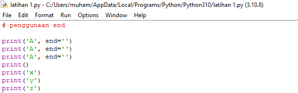
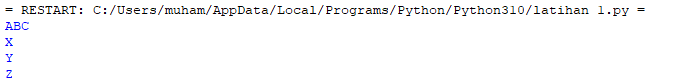
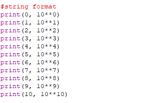
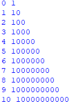
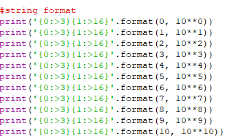
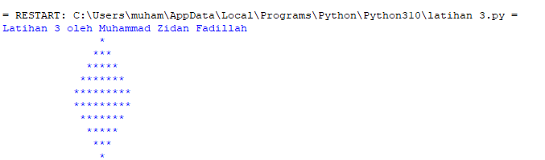

 # PROSES / LANGKAH - LANGKAH PRAKTIKUM 3
 
## Latihan 1

### - Penggunaan End 

Penggunaan end pada python ini bertujuan untuk memberikan jarak atau parameter untuk yang kita buat 

###- Penggunaan separator 

Penggunaan end pada python ini sebagai pemisah string setiap variabel yang di kasih nilai

###-String Format

Pemformatan string membuat kita mau tidak mau harus memasukan item ke dalam string daripada coba menggabungkan nya string memakai koma atau string concatenation

###- Contoh string concatenation

###- Yang di atas adalah contoh formating string 

###- Ada tiga cara peformatan yaitu

- Metode lama menggunakan placeholder menggunakan karakter '%'(modulo)'

- Teknik yang menggunakan metode string.format()

- Metode terbaru,baru saja di terbitkan oleh python 3.6,Menggunakan string literal yang di format,disebut f-string

###- Latihan 2

- pilih variable yang kita mau saya akan menggunakan dua variabel a dan b

###- Beri inputkan pada variabel

- Setelah di input masukan variabel yang telah di inputkan 
- Lalu saya akan menggabungkan Variabel a dengan b dengan menggunakan formatting string

###- Konversi nilai variabel

- konversi yang saya masukan adalah nilai variabel yang masih kurang lebih sama yaitu 'String' pada 'Integer' 
- Seusai itu kita harus menjumlahkan dan membagi dengan menggunakan seperti tadi yaitu menggunakan formatting string

###- Latihan 3 

- Buatlah kode program agar muncul gambar seperti di bawah ini 

Print(' { : > 16 } '. format (' * '))

Print(' { : > 17 } '. format (' * ' * 3))

Print(' { : > 18 } '. format (' * ' * 5))

Print(' { : > 19 } '. format (' * ' * 7))

Print(' { : > 20 } '. format (' * ' * 9))

Print(' { : > 20 } '. format (' * ' * 9))

Print(' { : > 19 } '. format (' * ' * 7))

Print(' { : > 18 } '. format (' * ' * 5))

Print(' { : > 17 } '. format (' * ' * 3))

Print(' { : > 16 } '. format (' * '))

###- Hasil yang di buat dalam kode program python

###- Membuat kode program pada python untuk menghitung luas dan keliling lingkaran menggunakan python 

r = input(" Masukan jari jari lingkaran:")

Pi = 3.14 

L = pi * int (r) * int(r)

print(" Luas Lingkaran:", 1)

print("Keliling Lingkaran:",3)

- Kemudian diminta memasukan nilai Jari-jari (r), dengan angka 20

- Kita deklarasikan variabel pi = 3.14

- Memasukan rumus luas dan keliling lingkaran 

L = pi * int(r) * int(r)

Pi = 3.14 

K = 2 * pi * int(r)

print("Luas lingkaran:", 1)

print("keliling lingkaran:",k)

###- Hasil kode program luas dan keliling lingkaran 

###- Flowchart lingkaran

###- Praktikum3 

- Dengan ini saya cukup mengerti algoritma lingkaran yang di proses dalam python

- Dapat menjelaskan langkah langkah dalam setiap langkah yang saya lakukan pada  eksekusi program 

- Dapat membuat flowchart dengan baik dan benar 

- Dapat mengoperasikan langsung kode program luas dan keliling lingkaran pada python

